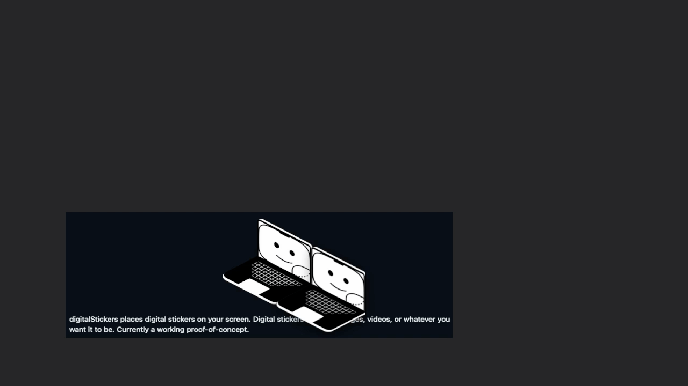

# digitalStickers

<p align="center">
  
</p>

Features
---
 - Places a preset sticker on your screen
 - You can move this sticker by dragging it
 - The sticker is always on top of everything on the screen by design

Building
---
Have not tested myself yet, but you should be able to clone this repo, cd into into the repos directory, then run

```
yarn
yarn start
```

`yarn` will automatically install any dependancies, and `yarn start` will run the application

This way you can customize the sticker which appears, by editing `index.html`

In `main.js` you can toggle some experimental features, like having stickers appear even in fullscreen mode. To enable this, uncomment the `type: panel` option under the BrowserWindows creation. Here you can also remove the shadows from the sticker, etc.

FYI: I have only tested this on x64 macOS. Windows and Linux should work fine, but there maybe some compatability issues and feature losses.

Planned Features
---
 - [ ] Adding your own sticker easily
 - [ ] Multiple stickers at once
 - [ ] Sticker book for collections of stickers
 - [ ] Options menu for sticker placement preferences

Technologies Used
---
Electron, Chromium, NodeJS, Javascript, HTML, CSS
